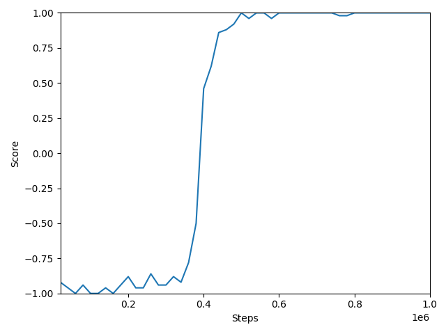
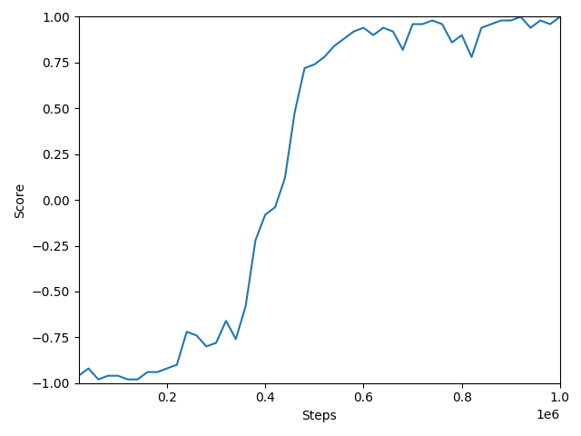

# Learning from Demonstration
## Introduction

This project is a simplified implementation of the 
[learning from demonstration](https://blog.openai.com/learning-montezumas-revenge-from-a-single-demonstration/) algorithm
developed by OpenAI. 

Policy gradients methods like Reinforce explore by taking actions randomly. Learning from demonstration bypasses the exploration problem by starting from demonstration
states.

## Algorithm
The file Pong.demo contains 22869 actions with 228 checkpoints (one checkpoint for every 100 actions). 
It's possible to jump to every of these checkpoints by using ```env.unwrapped.restore_state()```.

To simplify the problem we only play until the agent or the computer earns a point. The agent starts at action 
number 1800. At this checkpoint the agent is only a few actions away from receiving a point.
 
Once the agent beats the score of the demonstrator, we let the agent start at action number 1700. 
We keep doing this until the agent is playing from the start of the game.

## Results

## With demonstration 


## Without demonstration
